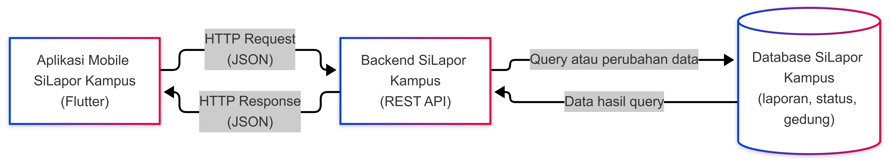
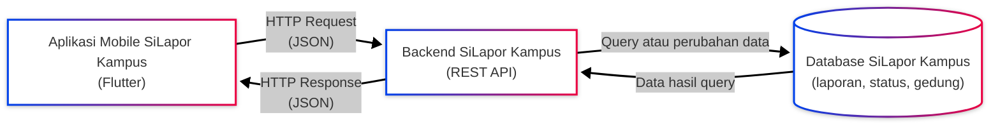

# Tugas 1 — Identifikasi Kebutuhan Aplikasi Bergerak

| | |
|:--|:--|
| **Nama** | Galih Permana Sidik |
| **NIM** | 230660221002 |
| **Kelas** | SI-VIIA |
| **Domain** | pengaduan fasilitas — SiLapor Kampus |

---

## 1. Deskripsi Sistem

SiLapor Kampus melibatkan **mahasiswa dan staf** sebagai pihak yang membuat laporan, serta **petugas pengelola gedung** yang bertugas menindaklanjutinya. Selama ini, kerusakan fasilitas seperti lampu mati, AC tidak berfungsi, atau gangguan WiFi hanya disampaikan lewat obrolan singkat atau secara lisan kepada pihak terkait, tanpa ada pencatatan yang jelas, akibatnya proses penanganannya pun berjalan lambat. Kondisi ini membuat mahasiswa tidak punya cara untuk mengecek sejauh mana laporannya diproses, sementara petugas kesulitan memantau mana kerusakan yang sudah ditangani dan mana yang masih tertunda. Aplikasi ini dirancang dalam bentuk mobile mengingat kerusakan biasanya ditemukan secara tiba-tiba saat pengguna sedang berada di tempat kejadian, sehingga karakteristik **konteks bergerak** menjadi relevan—pelapor bisa langsung mengambil foto dan mengirimkan laporan tanpa perlu menunggu sampai bertemu komputer. Di samping itu, aplikasi ini juga mengandalkan karakteristik **sesi penggunaan singkat**, mengingat alur yang dibutuhkan hanya sebatas membuka aplikasi, memotret kondisi kerusakan, menuliskan keterangan singkat, kemudian mengirimkannya; dengan alur sesingkat itu, interaksi sentuh pada layar berukuran kecil jauh lebih praktis dibandingkan harus mengakses versi web melalui desktop.

## 2. Diagram Arsitektur

File sumber: [`diagram.mmd`](diagram.mmd) (Mermaid).

Alur: aplikasi mengirim *HTTP Request* ke backend, backend meng-query atau mengubah data di database, database mengembalikan hasilnya ke backend, lalu backend mengirim *HTTP Response* ke aplikasi.

## 3. Tabel Kebutuhan

| No. | Permintaan | Pengguna | Karakteristik Mobile yang Terkait | Fitur Aplikasi | Materi Pemenuh |
|:---:|:-----------|:---------|:----------------------------------|:---------------|:---------------|
| 1 | Melihat daftar laporan kerusakan yang pernah dibuat | Mahasiswa | **Sesi penggunaan singkat**: riwayat harus cepat dibuka dan dibaca | Halaman riwayat laporan (list view) | Minggu 5–6 |
| 2 | Membuat laporan kerusakan baru dengan foto bukti | Mahasiswa | **Interaksi sentuh** dan **konteks bergerak**: laporan dibuat langsung di lokasi kejadian | Form laporan dengan akses kamera | Minggu 3 |
| 3 | Mencari laporan berdasarkan nama gedung atau ruangan | Mahasiswa, staf | **Layar kecil dan variatif**: hasil pencarian harus ringkas | Fitur pencarian dengan search bar | Minggu 5–6 |
| 4 | Mengirim laporan ke server dan menerima konfirmasi tersimpan | Mahasiswa | **Konektivitas terbatas**: koneksi di area kampus dapat tidak stabil | Integrasi REST API untuk submit laporan | Minggu 9–10 |
| 5 | Menyimpan draft laporan saat koneksi internet terputus | Mahasiswa | **Konektivitas terbatas** dan **daya dan data terbatas**: laporan tidak boleh hilang saat sinyal lemah | Penyimpanan lokal (draft offline) | Minggu 7 |
| 6 | Menerima notifikasi saat status laporan berubah (diproses/selesai) | Mahasiswa | **Sesi penggunaan singkat** dan **konteks bergerak**: pengguna tidak selalu membuka aplikasi | *Local notification* status laporan | Minggu 11 |
| 7 | Validasi form agar foto dan keterangan wajib diisi sebelum laporan dikirim | Mahasiswa | **Interaksi sentuh**: mencegah kesalahan input pada layar sentuh | Validasi input pada form laporan | Minggu 3 |
| 8 | Memverifikasi laporan masuk dan mengubah status penanganan | Petugas | Tidak berlaku (pekerjaan sisi server dan panel kelola) | **Di luar lingkup (backend SI)** — verifikasi dan pengelolaan status pada REST API dan database | Di luar PAB (Prak-backend, Basis Data) |
| 9 | Merekap laporan kerusakan per gedung untuk keperluan pengelola | Petugas | Tidak berlaku (pemrosesan dan pelaporan data di server) | **Di luar lingkup (backend SI)** — agregasi data dan laporan rekap di backend | Di luar PAB (Prak-backend, Basis Data) |

Catatan lingkup: baris 1–7 dikerjakan pada aplikasi mobile, sedangkan baris 8–9 menjadi tugas backend SI; aplikasi mobile hanya menampilkan hasilnya.

## 4. Bukti Environment Siap

| Bukti | File |
|:------|:-----|
| `flutter doctor -v` sebelum perbaikan | [`flutter-doctor/sebelum.png`](flutter-doctor/Sebelum.png) |
| `flutter doctor -v` sesudah perbaikan | [`flutter-doctor/sesudah.png`](flutter-doctor/Sesudah.png) |
| Aplikasi berjalan (emulator/perangkat fisik) | [`aplikasi.png`](Aplikasi.png) |

## 5. Refleksi

Untuk domain SiLapor Kampus, terdapat tiga fitur perangkat mobile yang paling dibutuhkan agar aplikasi dapat berfungsi secara optimal, yaitu sebagai berikut.

1. Kamera dibutuhkan agar pelapor bisa langsung mengambil dan melampirkan foto kondisi kerusakan saat itu juga, tanpa harus mengunggahnya belakangan dari perangkat lain.
2. Lokasi dibutuhkan agar titik kerusakan tercatat dengan tepat tanpa mengharuskan pelapor mengetik alamat secara manual.
3. Notifikasi dibutuhkan agar pelapor tetap mendapat kabar terbaru soal status laporannya tanpa harus terus-menerus membuka aplikasi.