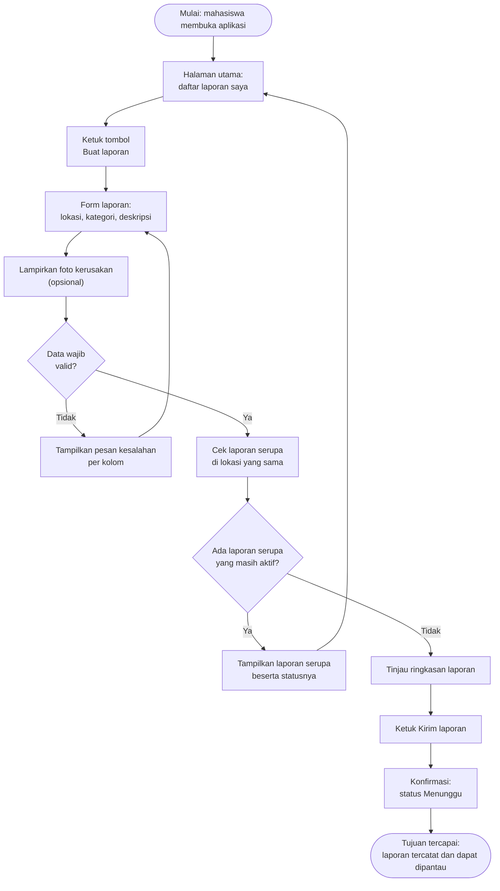

# Dokumen Kebutuhan dan User Flow: SiLapor Kampus

Penulis: Galih Permana Sidik | NIM 230660221002 | SI-VIIA | Pemrograman Aplikasi Bergerak

---

## 1. Deskripsi Aplikasi

SiLapor Kampus adalah aplikasi mobile untuk melaporkan kerusakan fasilitas kampus, seperti proyektor, pendingin ruangan, keran, atau kursi, dan memantau penanganannya sampai selesai. Selama ini laporan kerusakan umumnya disampaikan lewat pesan berantai atau secara lisan, sehingga mudah terlewat, sering terkirim ganda, dan pelapor tidak tahu apakah laporannya sudah ditangani. Solusi berbentuk aplikasi mobile dipilih karena kerusakan ditemukan di lokasi, tepat saat pelapor memegang ponsel, sehingga laporan dan foto bisa dibuat saat itu juga. Web desktop menuntut pelapor kembali ke komputer, dan cara manual tidak meninggalkan status yang bisa dilacak.

## 2. User Persona

### Persona 1 — Dina — Mahasiswa pelapor

| Komponen | Isi |
|:---------|:----|
| Nama dan peran | Dina, mahasiswa pelapor |
| Tujuan | Melaporkan fasilitas yang rusak dengan cepat dan mengetahui kapan laporannya ditangani |
| Kendala | Menemukan kerusakan di sela jadwal kuliah sehingga hanya punya beberapa menit; tidak tahu apakah kerusakan yang sama sudah pernah dilaporkan orang lain |
| Perangkat dan konteks | Ponsel Android, dipakai langsung di lokasi kerusakan atau di sela pergantian kelas |
| Frekuensi penggunaan | Membuat laporan sesekali, sekitar 1 sampai 2 kali per bulan; membuka aplikasi untuk mengecek status beberapa kali per minggu selama laporan belum selesai |

### Persona 2 — Pak Asep — Petugas sarana dan prasarana

| Komponen | Isi |
|:---------|:----|
| Nama dan peran | Pak Asep, petugas sarana dan prasarana (sarpras) |
| Tujuan | Mengetahui seluruh kerusakan yang perlu ditangani, menentukan urutan pengerjaan, dan mencatat hasil penanganan |
| Kendala | Laporan masuk dari banyak jalur dan sering ganda sehingga waktu habis untuk memilah; harus berpindah lokasi sepanjang hari |
| Perangkat dan konteks | Ponsel Android, dipakai sambil berkeliling kampus dan saat istirahat di ruang sarpras |
| Frekuensi penggunaan | Membuka daftar laporan beberapa kali sehari dan memperbarui status setiap selesai menangani satu laporan |

## 3. Kebutuhan Fungsional

| ID | Rumusan Kebutuhan | Terkait Persona |
|:---|:------------------|:----------------|
| F-01 | Mahasiswa dapat membuat laporan kerusakan dengan mengisi lokasi, kategori, dan deskripsi, sehingga laporan tersimpan dan tampil pada daftar laporan saya dengan status Menunggu | Persona 1 |
| F-02 | Mahasiswa dapat melampirkan satu foto kerusakan pada laporan, sehingga foto tampil pada detail laporan | Persona 1 |
| F-03 | Mahasiswa dapat melihat status setiap laporannya (Menunggu, Diproses, Selesai, atau Ditolak), sehingga status yang tampil sama dengan status terakhir yang ditetapkan petugas | Persona 1 |
| F-04 | Mahasiswa dapat melihat laporan serupa yang masih aktif pada lokasi yang sama sebelum laporannya dikirim, sehingga laporan ganda dapat dihindari | Persona 1 |
| F-05 | Petugas sarpras dapat melihat daftar laporan masuk yang diurutkan dari yang terbaru, sehingga seluruh laporan berstatus Menunggu terlihat dalam satu daftar | Persona 2 |
| F-06 | Petugas sarpras dapat mengubah status laporan beserta catatan penanganan, sehingga status baru dan catatan tersimpan pada laporan tersebut | Persona 2 |
| F-07 | Mahasiswa dapat mencari laporan berdasarkan lokasi atau kata kunci, sehingga hanya laporan yang cocok yang tampil pada daftar | Persona 1 |
| F-08 | Mahasiswa dapat membatalkan laporan yang masih berstatus Menunggu, sehingga laporan tersebut tidak lagi muncul pada daftar petugas | Persona 1 |
| F-09 | Petugas sarpras dapat menyaring daftar laporan berdasarkan kategori, sehingga hanya laporan pada kategori terpilih yang tampil | Persona 2 |
| F-10 | Mahasiswa dapat menerima pemberitahuan ketika status laporannya berubah, sehingga tidak perlu membuka aplikasi untuk mengetahui perkembangan | Persona 1 |

## 4. Kebutuhan Nonfungsional

| ID | Kategori | Rumusan | Kriteria Terukur |
|:---|:---------|:--------|:-----------------|
| NF-01 | Kegunaan | Pembuatan laporan harus singkat karena pelapor hanya punya waktu beberapa menit di sela kuliah | Dari halaman utama hingga konfirmasi, pengguna melakukan maksimal 6 langkah pada alur tanpa kesalahan input |
| NF-02 | Kinerja | Daftar laporan harus tampil cepat agar petugas tidak menunggu saat berpindah lokasi | Daftar laporan tampil kurang dari 3 detik pada jaringan kampus |
| NF-03 | Keamanan | Identitas pelapor tidak boleh terlihat oleh pengguna lain | Pada tampilan laporan serupa (F-04), nama pelapor tidak ditampilkan pada 100% laporan milik pengguna lain |

## 5. Prioritas Fitur (MoSCoW)

| Prioritas | ID Kebutuhan | Alasan |
|:----------|:-------------|:-------|
| Must have | F-01, F-03, F-04, F-05, F-06 | Kelima fungsi ini membentuk satu siklus lengkap: Dina melapor (F-01), petugas melihat dan memproses (F-05, F-06), Dina memantau hasilnya (F-03). F-04 tetap Must karena laporan ganda langsung menambah beban kerja Pak Asep dan melemahkan tujuan aplikasi |
| Should have | F-02, F-07 | Foto membantu petugas menilai kerusakan, tetapi laporan berisi lokasi dan deskripsi sudah cukup untuk MVP. Pencarian baru terasa perlu setelah jumlah laporan banyak |
| Could have | F-08, F-09 | Pembatalan dan penyaringan kategori menambah kenyamanan, tetapi tugas utama kedua persona tetap bisa diselesaikan tanpa keduanya |
| Won't have (saat ini) | F-10 | Pemberitahuan bergantung pada fitur perangkat yang baru dipelajari pada paruh akhir semester. Sementara itu, status tetap dapat dicek manual lewat F-03. Ditunda, bukan dibuang |

## 6. Pemetaan Kebutuhan ke Antarmuka

| ID Kebutuhan | Rumusan (ringkas) | Prioritas | Halaman yang Memenuhi | Widget yang Direncanakan (P3) |
|:-------------|:------------------|:----------|:----------------------|:------------------------------|
| F-01 | Membuat laporan (lokasi, kategori, deskripsi) | Must | Halaman form laporan | `Scaffold` + `AppBar` + `Column` |
| F-02 | Melampirkan foto kerusakan | Should | Halaman form laporan | `Card` + `Row` (area pratinjau foto) |
| F-03 | Melihat status laporan | Must | Halaman utama mahasiswa (daftar laporan saya) | `ListView.builder` + `ListTile` + `Text` status berwarna |
| F-04 | Melihat laporan serupa sebelum kirim | Must | Halaman laporan serupa | `ListView.builder` + `Card` |
| F-05 | Melihat daftar laporan masuk | Must | Halaman daftar laporan masuk (petugas) | `ListView.builder` + `ListTile` |
| F-06 | Mengubah status dan mencatat penanganan | Must | Halaman detail laporan (petugas) | `Scaffold` + `Column` + `Row` |
| F-07 | Mencari laporan | Should | Halaman utama mahasiswa + kolom pencarian | `ListView.builder` + `where` (P2) |
| F-08 | Membatalkan laporan Menunggu | Could | Halaman detail laporan (mahasiswa) | `Scaffold` + `Column` + `Row` |
| F-09 | Menyaring laporan menurut kategori | Could | Halaman daftar laporan masuk (petugas) | `Row` + `ListView.builder` |
| F-10 | Menerima pemberitahuan perubahan status | Won't | Belum direncanakan | Belum direncanakan |

## 7. User Flow

### 7.1 Identitas Alur

| Aspek | Isi |
|:------|:----|
| Nama alur | Membuat laporan kerusakan fasilitas |
| Aktor | Persona 1, Dina (mahasiswa pelapor) |
| Tujuan alur | Laporan tercatat dengan status Menunggu dan dapat dipantau pada daftar laporan saya |

### 7.2 Diagram User Flow

### 7.3 Daftar Langkah

| No. | Jenis | Langkah/Halaman | Bila gagal |
|:---:|:------|:----------------|:-----------|
| 1 | Mulai | Mahasiswa membuka aplikasi | — |
| 2 | Halaman | Halaman utama: daftar laporan saya | — |
| 3 | Proses | Ketuk tombol Buat laporan | — |
| 4 | Halaman | Form laporan: lokasi, kategori, deskripsi | — |
| 5 | Proses | Lampirkan foto kerusakan (opsional) | — |
| 6 | Keputusan | Data wajib valid? | Tampilkan pesan kesalahan per kolom, kembali ke form (langkah 4) |
| 7 | Proses | Cek laporan serupa di lokasi yang sama | — |
| 8 | Keputusan | Ada laporan serupa yang masih aktif? | Tampilkan laporan serupa beserta statusnya, kembali ke halaman utama untuk memantau laporan yang sudah ada (langkah 2) |
| 9 | Halaman | Tinjau ringkasan laporan | — |
| 10 | Proses | Ketuk Kirim laporan | — |
| 11 | Halaman | Konfirmasi: status Menunggu | — |
| 12 | Tujuan | Laporan tercatat dan dapat dipantau | — |

Diagram ini memuat 8 langkah pada jalur utama (langkah 2, 3, 4, 5, 7, 9, 10, 11) dan 2 titik keputusan. Kedua keputusan memiliki cabang gagal yang ditindaklanjuti dan tidak ada langkah yang buntu.

---
